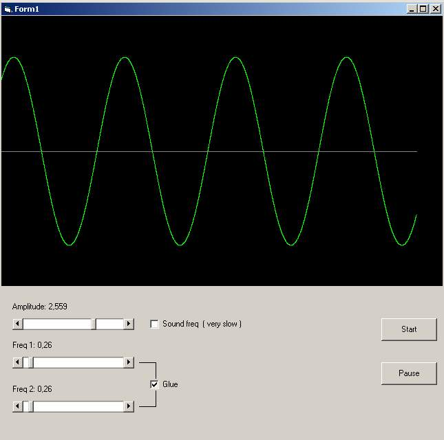

## Sinusoid\_MustSee

### Description

Draw's sinusoid, with only one math formula , at the end picture box disapeares but that is not important, this code is for math demonstration,Votes, complains,... are welcome
 
### More Info
 

             |
---                |---
**Submitted On**   |2004-05-06 18:27:08
**By**             |[Matija Skrgulja](https://github.com/Planet-Source-Code/PSCIndex/blob/master/ByAuthor/matija-skrgulja.md)
**Level**          |Intermediate
**User Rating**    |3.8 (15 globes from 4 users)
**Compatibility**  |VB 5\.0
**Category**       |[Coding Standards](https://github.com/Planet-Source-Code/PSCIndex/blob/master/ByCategory/coding-standards__1-43.md)
**World**          |[Visual Basic](https://github.com/Planet-Source-Code/PSCIndex/blob/master/ByWorld/visual-basic.md)
**Archive File**   |[Sinusoid\_M174253572004\.zip](https://github.com/Planet-Source-Code/matija-skrgulja-sinusoid-mustsee__1-53632/archive/master.zip)

